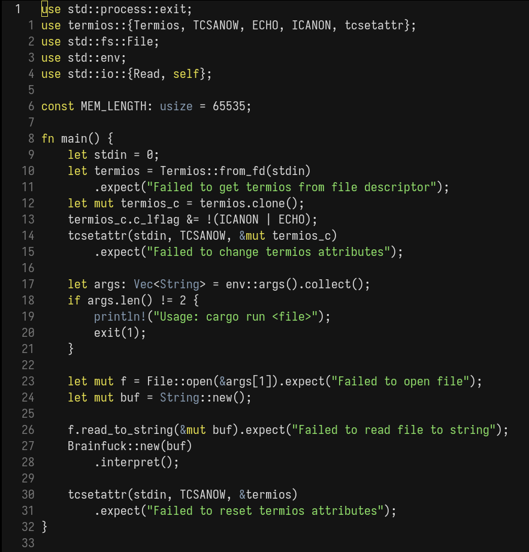

# YELLO WORLD

Dark theme for neovim highly inspired by [Gruber Darker](https://github.com/rexim/gruber-darker-theme) by [Alexey Kutepov](https://github.com/rexim)

## Screenshots



## Installation

### Using packer: 

```lua
require packer.startup(function(use)
    -- ...

    use "rbnrayan/yello_world.nvim",

    -- ...
end)
```

### Using lazy:

```lua
-- in plugins.lua
return {
    -- ...

    "rbnrayan/yello_world.nvim",

    -- ...
}

-- or in your lazy configuration
require("lazy").setup({
    -- ...

    "rbnrayan/yello_world.nvim",

    -- ...
})
```
